# AIOps Dashboarding

IBM Cloud Pak for AIOps has a couple of key options for dashboarding and this guide will help you understand which is suitable for your particular use-cases, the deployment architectures, and the steps needed to get started. The two options are:

## Cognos Analytics
IBM Cognos Analytics, also known as CA, can be deployed separately to AIOps to allow users to build powerful, bespoke dashboards and reports that meet specific business needs using data fed from the AIOps cluster via a DB2 integration. Whilst requiring an external install on a separate VM, the solution allows you to take specific data from AIOps, pass it through a bespoke schema in DB2 that you can customize to your own business use cases, and then combine and build relationships with other data sources from other tools and systems that you may use to create highly diverse and functional reports and dashboards.

## AIOps dashboarding toolkit
The AIOps dashboarding toolkit enables you to build fully customized dashboards using JavaScript and React, which can be seamlessly embedded within the AIOps user interface alongside existing pages. This flexibility allows you to create bespoke solutions tailored to virtually any use case. Panels written with the toolkit can get access to all available APIs, many of which are exposed in an easy-to-use format, and supports integration with external systems when needed. Additionally, you can incorporate existing AIOps widgets—such as the alert list, topology viewer, and incident list—directly into your custom pages, ensuring a consistent and integrated user experience.

Aside from just building custom panels with the toolkit, it can also be used to integrate other pages from external sources into AIOps, such as pages from Impact, Grafana, or other sources of your choice. These can also be combined with some custom panel content and/or an AIOps widget allowing you to create a very dynamic page consisting of multiple different content sources.

## So which should I choose?

**Use case 1:** I need a reporting solution that can send out scheduled reports on key metrics derived from my Alert and Incident data
**Recommendation:** Cognos Analytics

**Use case 2:** I need dashboards that can show historical data and insights from my Alert and Incident data
**Recommendation:** Cognos Analytics

**Use case 3:** I need dashboards that can show summaries of live data, from a variety of sources including AIOps
**Recommendation:** Cognos Analytics

**Use case 4:** I need dashboards that can show live data but provide an interactive experience to drill down into more AIOps or other context (e.g. like monitor boxes)
**Recommendation:** Cognos Analytics OR Dashboarding toolkit

**Use case 5:** I need to surface my existing Impact operator view within AIOps
**Recommendation:** Dashboarding toolkit

**Use case 6:** I need to surface my existing Grafana dashboard within AIOps
**Recommendation:** Dashboarding toolkit

**Use case 7:** I need a highly bespoke dashboard with a precise look and feel, and complex interactions
**Recommendation:** Dashboarding toolkit

### Key notes about the capabilities/differences

- In both solutions, you can leverage the core AIOps widgets: Alert List, Incident List, and Topology View. However, in Cognos the ability to define custom wiring/event handling (such as on-click events for row selection) is not possible whereas in the toolkit it is.
- In Cognos you can use historical data and live data as it simply depends on what you pass through to DB2 using your policies. The key thing there is setting the schema that can accommodate both cases, as you would not want to keep pulling all the data from one single database as it could grow out of control.
- Dashboards in the dashboarding toolkit can simply tap into the existing AIOps APIs. Today, these currently only offer live data, but they do offer more variety than what you can pass through to DB2.

## Cognos Analytics with AIOps

### Deployment architecture
In short, Cognos Analytics will run separately to AIOps and not on the same Openshift cluster. We had explored this 'in-cluster' deployment method previously (in tech preview), but decided to abandon as Cognos were looking at their own architecture changes. As such, we currently only support working with separately installed on-premise Cognos instances.

Cognos can be linked in a few ways to create a more seamless experience between the two. The key parts are:
1) An SSO configuration, allowing you to leverage the same identity provider in both AIOps and Cognos. This is also a critical requirement when using the AIOps widgets within Cognos.
2) A Db2 database and connector that provides a data flow from AIOps to Cognos.
3) AIOps widgets in Cognos, allowing you to use the Alert list, Incident list and Topology viewer from within Cognos dashboads.

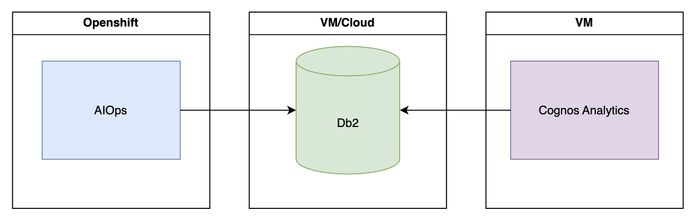

In theory, you could leverage the same VM for your Cognos and Db2 deployments, but it is recommended to use separate VMs for each purpose. Db2 is available on various platforms including on Cloud, but refer to the compatibility and part entitlements below to ensure you use a supported version.

Two key questions that come up relating to the architecture are:
1) Will the data in Cognos be lagging behind that of AIOps?
The short answer is no, not really! The longer answer is that the data in Cognos will be updated in near real-time from AIOps but it will depend on a few factors, including the transfer rate through the Db2 connector, the schema, and then the refresh/cache settings on the Cognos side. As well a the speed, the throughput must also be considered and for the Db2 connector it currently supports 700/s for inserts and 300-400/s for updates of alerts, using the default schema.
When working at high load, the connector will also batch inserts/updates to Db2 so you may see a minor delay (in terms of seconds) before the data arrives in Db2.
In typical ops environments, clients will have their Alert viewer set to a refresh time of 60 or 30 seconds at most, so this provides ample time for the alert insertion/processing to take place across the two systems.
See [Data caching and refresh intervals](#data-caching-and-refresh-intervals) for more information.

2) Is the data in the AIOps Alert list widget in Cognos the same?
Essentially the Alert list widget in Cognos is an iframed version of the AIOps Alert list widget. As such, the widget will be pulling data directly from the AIOps APIs rather than from the Db2 database, so if there is a mismatch in refresh timings between the Alert list and the Cognos visualisations then you may temporarily see a mismatch of the data displayed. This is the same for the Incident List widget, but not for the Topology Viewer as we currently do not allow data to be exported to Db2 so this does not apply.
The diagram below shows this data flow:

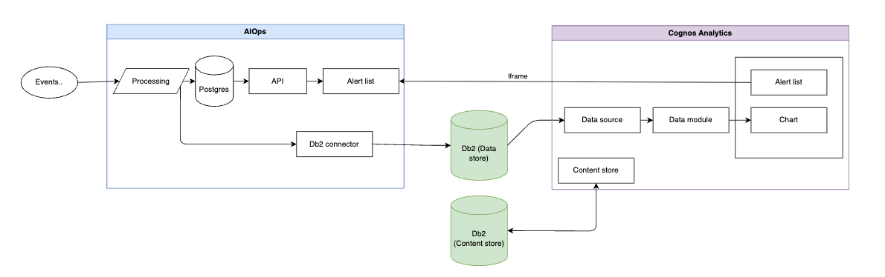

### Prerequisites

#### Licensing
By default, AIOps entitles 25 users of Cognos Analytics, 1 of which can be an administrator. For NOI, it is 5 users, 1 of which can be an administrator. There are specific parts associated to these licenses and care should be taken as Cognos Analytics and Db2 come in various deployment forms.

The top level AIOps and NOI entitlements are documented here:
AIOps: https://www.ibm.com/support/customer/csol/terms/?id=L-LCKC-79KSJP&lc=en
NOI: https://www.ibm.com/support/customer/csol/terms/?id=L-QVLE-KVZBSX&lc=en

For Db2, it is included as part of the supporting programs.

#### Infrastructure
Both Cognos Analytics and Db2 will run on separate (one, or multiple) VMs. Db2 is available on RHOS, K8s, and on Cloud even, but it has not been officially tested for the integration for AIOps. Db2's role is straightforward so many versions/variants may well work beyond those specified by the part number supplied. Cognos Analytics is also available in different deployment methods and flavours but is more likely to have problems with the AIOps integration script if not the officially supported version.

**Recommendation:**
- 1x RHEL 9.2 x86-64 VM for Cognos Analytics 12.1.1
  Supported environments lists all the possible options for CA in general, but the integration script for AIOps is only tested on RHEL 8.8/9.2 at present.

- 1x RHEL 9.2 x86-64 VM for Db2 11.5
  Supported environments lists all the other options for Db2.

#### Sizing
There are two main parts to sizing the deployment:
1) Sizing the deployment for the software itself to run, e.g CPU/Memory/Storage requirements regardless of data
2) Sizing the database for the data it will contain.

For the software sizing, refer to the respective guidance:

- **For Cognos Analytics:** See the reference IBM Cognos Analytics High Level sizing presentation provided along with this guide.
- **For Db2:** Review the basic hardware requirements [here](https://www.ibm.com/software/reports/compatibility/clarity-reports/report/html/softwareReqsForProduct?deliverableId=7F28FF90669E11E982882C5D069DA07A&osPlatforms=Linux&duComponentIds=S009|S006|S002|S007|S005|A003|A008|A004&mandatoryCapIds=spcrAllValues&optionalCapIds=spcrAllValues), but additionally the Db2 setup wizard will provide guidance on disk sizing required. Additional notes on memory requirements can be found [here](https://www.ibm.com/docs/en/db2/11.5.x?topic=servers-disk-memory-requirements#r0008877__title__3).

For the storage sizing, the key will be estimating the usage based on the data you intend to store.

For the AIOps data, you can use the following calculation as a starting point:
**Alerts:**
```
(<alert inserts per day> * (<bytes per alert> + <bytes per alert audit entries>) * <x weeks> * <y days>) / (1024 ^ 3)
```
Using the default schema:
`<bytes per alert> = 5168`
`<bytes per alert audit entries> = 3777`

**Incidents:**
```
(<incident inserts per day> * (<bytes per incident> + <bytes per incident audit entries>) * <x weeks> * <y days>) / (1024 ^ 3)
```
Using the default schema:
`<bytes per incident> = 3082`
`<bytes per incident audit entries> = 3745`

A working example would be as follows: For an environment using the standard schema, but no audit tables and with 10,000 alerts per day, the space required for 1 years worth of alert data would be:
```
(10000 * (5168 + 0) * 52 * 7) / (1024 ^ 3) = 17.5 GB
```
The calculation refers to alert inserts rather than just alerts, as this will happen after deduplication in AIOps. The calculation also assumes that every alert insert is triggering an update on every audit table, which is highly unlikely. As such, you an reduce the values to suit your own processing and crucially your own schema - if you update the schema and add new properties etc, you will need to accomodate the sizing for this. Refer to the Db2 guidance on sizing for columns here: https://www.ibm.com/docs/en/db2/11.5.x?topic=statements-create-table#r0000927__title__56 and ammend as necessary.

It will be important to clarify your own rates and sizes fairly accurately before using this calculation, but either way you will want to add some additional space as a buffer and in case of any unexpected surges in activity. Db2 will also require its own storage, so refer to the guidance provided in their install instructions.

#### Parts
The relevant parts can be found by looking at the [Passport Advantage part numbers document](https://www.ibm.com/docs/en/cloud-paks/cloud-pak-aiops/latest?topic=planning-passport-advantage-part-numbers) for Cloud Pak for AIOps, per release.

For example, for Cloud Pak for AIOps version 4.11.1, you would find the following parts needed:

- **G0GC7ML** - IBM Cognos Analytics Cartridge 12.1.0 Linux for IBM Cloud Pak for AIOps 4.11.1 eAssembly
- **G0GBZML** - IBM Db2 Server Standard 11.5 VPC Option for IBM Cognos Analytics Cartridge 12.1.0 for IBM Cloud Pak for AIOps 4.11.1 eAssembly

### Installation planning for Cognos and Db2
For both, you will need a VNC or X setup on the VMs to allow usage of the installation and configuration GUIs. [This guide](https://www.ibm.com/support/pages/how-install-cognos-analytics-red-hat-enterprise-linux) from Cognos Analytics support can help if needed.

For Db2 planning you will want to refer to:
- [Preparing to install Db2 database](https://www.ibm.com/docs/en/db2/11.5.x?topic=servers-preparing-install-db2-database)
- [Suggested settings for creating content store in Db2](https://www.ibm.com/docs/en/cognos-analytics/12.1.x?topic=gccs-suggested-settings-creating-content-store-in-db2-linux-windows-unix-operating-systems)

The former contains a multitude of configuration options for Db2, most, if not all, of which will not be applicable for simple deployments. The latter describes some specific Db2 parameters and configuration needed for when using Db2 as a content store for Cognos Analytics and these should not be ignored.

For Cognos Analytics you will want to refer to the [Cognos workflow documentation](https://www.ibm.com/docs/en/cognos-analytics/12.1.x?topic=analytics-cognos-workflow) for general guidance on getting setup with Cognos.

The integration with AIOps is currently only tested with a single server installation, but that isn't to say working with a distributed setup is impossible. Either way, the distributed setup would only be necessary for extensive Cognos workloads.

### Installation
Install Db2 and Cognos Analytics per the documentation. There are no unique requirements for the AIOps integration during these phases.

### Post install

1. **Add the Db2 driver to Cognos**
   Simply copy it across (as cognos user) from your Db2 install to your Cognos install, e.g:
   ```bash
   sudo cp /opt/ibm/db2/V11.5/java/db2jcc4.jar /opt/ibm/cognos/analytics/drivers/
   ```

2. **Configure the content store**
   Cognos requires a database instance to act as a store for all the 'content' you produce within Cognos, such as dashboards, data models and reports. The recommendation here is to just use another Db2 database (on the same instance), but Cognos does also support a variety of other database technologies. If you intend to use a Db2 as the Cognos Content Store, refer to [this guide](https://www.ibm.com/docs/en/cognos-analytics/12.0.x?topic=sudcdcs-generating-script-file-create-database-db2-content-store) for setting up a Db2 database for this purpose. Note that you must already have installed both Db2 and Cognos before performing this step.

3. **Configure SSL**
   SSL must be configured prior to setting up the integration with AIOps. Guidance is provided [here](https://www.ibm.com/docs/en/cognos-analytics/12.0.0?topic=components-configuring-ssl-cognos-analytics). For a very basic configuration, simply switch the following Group Properties in the Cognos Configurator to https:
   - Gateway URI
   - Dispatcher URIs for gateway
   - Controller URI for gateway
   - External dispatcher URI
   - Internal dispatcher URI
   - Dispatcher URI for external applications
   - Content Manager URIs

### Link Cognos and AIOps
The steps, scripts, and examples/assets for linking the two can be found in our [public GitHub Repository](https://github.ibm.com/hdm/aiops-custom-widget-cognos-integration/tree/main/) split into different sections. The key sections you will need, in order:

1. **Integration** - Follow the readme provided to link the two environments, including setting up SSO and navigation directly from AIOps to Cognos.
2. **Widgets** - These are AIOps widgets that can be used in Cognos.
3. **Schemas** - These are the out of the box database schemas for Alerts and Incidents, for use with DB2 and for dashboarding and reporting purposes within Cognos.
4. **Examples** - These are the out of the box example dashboards/assets for Cognos.

Follow the respective Readme files in each section to setup Cognos and AIOps to work together. For the examples, you can read the section further through this guide for more detailed information.

### Configure permissions to see Cognos navigation entry in AIOps

For any roles that require visibility of the Cognos navigation entries you can add the required permission via the Access Control UI. View the [user access control documentation](https://www.ibm.com/docs/en/cloud-paks/cloud-pak-aiops/latest?topic=pak-managing-user-access-control) for overall details, and add the appropriate dashboarding role.

### Connecting AIOps to DB2

Using the IBM Db2 integration is straightforward. Navigate to **Menu → Define → Integrations**, click **'Add integration +'** and search for IBM Db2. Follow the on-screen guidance, or the [IBM documentation](https://www.ibm.com/docs/en/cloud-paks/cloud-pak-aiops/latest?topic=integrations-db2-integration).

### Configuring a dashboard or report policy
To trigger Alert and Incident data to flow through the connector, a policy must be created to control this. Navigate to **Menu → Operate → Automations** and click **'Create policy +'**. Find the **'Populate a dashboard or report'** template and click the tile. The Policy Details, Execution Order, Triggers and Condition Set sections are all common with other AIOps policy types. See the [policy editor documentation](https://www.ibm.com/docs/en/cloud-paks/cloud-pak-aiops/latest?topic=policies-policy-editor) for more information. The key section of this policy type is the 'Populate a dashboard or report' section, where you can define the Db2 connection, the target table for the data to be inserted into, and the mapping of AIOps fields to database columns.

For the table, if you are using the provided schema then use the respective `_REPORTER_STATUS` table for Alerts and Incidents.

For the mappings, a default mapping is provided and this matches the example schema we provide in our [samples repository](https://github.com/IBM/cp4waiops-samples/blob/main/aiops-cognos-analytics/schemas/README.md#reporting-schemas). Alternatively, you can select the 'Customise' option and control the mapping yourself, using the provided editor. By default, the mapping will present the columns available in the database along with their respective data types (note – the data types are high level categories rather than data types as defined by Db2. For example, a Db2 'VARCHAR' column is simply labelled as a string column).


Use the 'Select template' drop down in the mapping editor to switch between the table columns template and the default mapping template but be cautious to save any changes as your changes will be removed by doing so.

> **Note:** If you want to customise the mapping (and Db2 schema...this will be a prerequisite) then refer to the [Customising the schema and mapping](#customising-the-schema-and-mapping) section.

> **Note:** As of AIOps version 4.7, there is no feedback mechanism for an incorrect policy mapping and therefore it is crucial to ensure the fields match up to your target database schema, particularly if you have customised it.


## Working with Cognos Analytics

### Using the examples
Before working with your own data, a good starting point is to import both the Cognos and AIOps examples to get an idea of what you can do.

For AIOps read the following [guidance](https://github.com/IBM/cp4waiops-samples/blob/main/aiops-cognos-analytics/examples/README.md).

AIOps provides the following two examples:

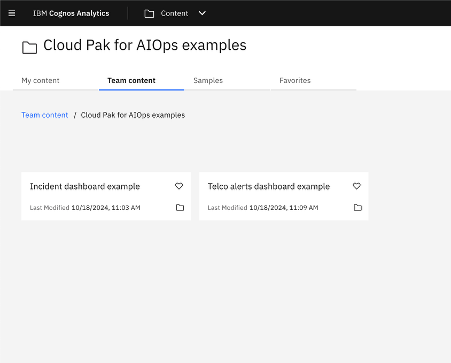

Using the Incident dashboard example as an example, opening the folder will show a dashboard and a Data folder.

Clicking the 'Incident dashboard' will reveal the dashboard itself, which looks as follows:

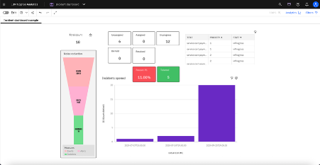

If you want to quickly navigate back to the Content folder, use the menu at the top:

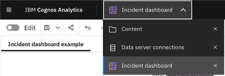

From here, you could then view the 'Data' folder which looks as follows:

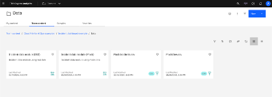

The above shows two 'Data modules' (see below section for more information) and two CSV files. The Incident data module (Mock) is used to manage the mock data for use in the dashboard shown previously, and essentially contains a pair of tables representing the data taken from the MockView and MockIncidents CSV files:

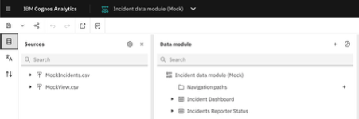

The tables provide various columns from which the dashboard can be built, such as the counts of events, alerts, and incidents, used for the funnel chart:

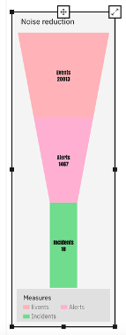
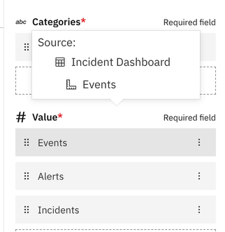

You can review the sources of visualisations in a dashboard by entering Edit mode, selecting the visualisation, and clicking the 'Fields' tab:

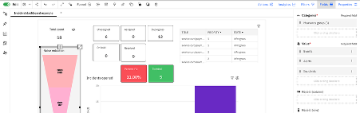

The AIOps example dashboards are configured to use the mock data by default. To link the dashboards up to real data in your own DB2 database:

1. Follow the 'Connecting to your Db2 instance' guidance below
2. Follow the [relinking guidance](https://github.com/IBM/cp4waiops-samples/blob/main/aiops-cognos-analytics/examples/README.md#13-example-dashboards-use-mock-data-by-default-to-use-your-own-live-data-with-the-examples)

Cognos Analytics also provides several great dashboard and report examples that you can use for inspiration. The [documentation](https://www.ibm.com/docs/en/cognos-analytics/12.1.x?topic=samples-cognos-analytics-base) provides guidance on how to import these. The process is very similar to the AIOps import process.

### Connecting to your Db2 instance
On the Cognos side, you will first need to connect to your Db2 datasource. To achieve this:

1. In Cognos, navigate to **Menu → Manage → Data server connections**
2. Click **'New +'** and select **'Data server'**
3. Provide a name, optional description, and select the relevant Db2 connection type
4. Provide the connection details. At the Authentication section, you can create a 'Signon' in which you provide the username and password for Db2. Choose 'Use signon' in the dropdown, click 'Add signon' and then provide the details.
5. Test the connection before saving
6. Click on the newly created data server
7. Click the 3 dot 'Action menu' for the respective schema row in the table
8. Select 'Assets'
9. Click the 3 dot menu for the asset row and select 'Load metadata'. This will load the tables for the database.
10. Click 'Done' when complete

Read more: [Using data servers as data module](https://www.ibm.com/docs/en/cognos-analytics/12.1.x?topic=sources-using-data-servers-as-data-module)

### Data modules in general
Creating a data module is simple:

1. Navigate to **Menu → + New → Data Module**
2. In the Select sources screen, select 'Data servers and schemas', and select your database, followed by the schema. At this stage you could also select other data sources, such as sample CSV files or other databases you may have at your disposal.
3. Click 'Ok'.
4. At this stage you can choose either to 'Select tables' or 'Discover related tables'. The latter is a tool provided by Cognos using NLP and AI to help suggest relationships between tables. More information can be found [here](https://www.ibm.com/docs/en/cognos-analytics/12.1.x?topic=sources-discovering-related-tables). For the purposes of this guide, choose 'Select tables' followed by 'Next'.
5. Select all the tables and click 'Ok'.
6. At this stage you now have a Data Module containing the entire schema. If you view the 'Relationships' tab you will see that Cognos has detected some relationships due to the structure of the schema.
7. If additional data sources are needed for your dashboarding needs, they can then be included into the data module and relationships formed between the Alerts/Incidents schema and others.
8. Be sure to save your Data Module after finishing any changes

With a Data Module created, you can now create a Dashboard or Report using the Data Module. For this guide we will create a Dashboard, and you can create one from the Data Module editor:

1. Click the 'Create dashboard' in the top corner of the UI.
2. Alternatively, navigate to **Menu → + New → Dashboard**
3. If you came via the Data Module you will find it is already added under the Sources section from the left-hand toolbar. Otherwise, under Sources click the '+' icon and select the relevant Data Module. Click 'Add' to add it to the editor.

You can now start building out your dashboard. An example starting point would be a bar chart representing the alert counts per severity.

1. Select 'Visualisations' from the left-hand toolbar and click and drag the 'Bar' visualisation onto the grid
2. The 'Fields' tab should be selected on the top editor toolbar, with a right-hand panel showing the various fields that the visualisation supports.
3. In this example, we want different bars for each severity, so click on the Bars field (where it states 'Click or drag here')
4. Find the Alerts Reporter Status table, then select the Severity column
5. For the Length field, we want a count of alerts. To do this we can count the Ids of alerts, as these are unique, so click on the field and find the Alerts Reporter Status table, then select the Id column.

At this stage, you will have a simple chart showing you the count of alerts for each severity. However, you may notice that depending on your data you may not have a bar for each severity, as Cognos is simply displaying the range of severities found in the Alerts Reporter Status table, rather than the entire possible set.

To solve this, we can create a relationship in the Data Module:

1. Navigate back to the Data Module created earlier. In the Cognos toolbar there is a toolbar to access currently open windows, so you can quickly navigate to and from an open Data Module and Dashboard.
2. First, you need to ensure the column usage is correctly set for both columns you want to join:
   - Expand the 'Alerts Reporter Status' table and find the 'Severity' column.
   - Right click, or click the 3 dot menu, and select Properties.
   - Ensure the 'Usage' property is set to 'Identifier'.
   - Repeat this for the 'Alerts Severity Types' table.
3. In the 'Relationships' tab:
   - Select the 'Alerts Severity Types' and 'Alerts Reporter Status' tables using Cmd/Ctrl + Click
   - Right click either of the two and select 'New → Relationship'.
   - Ensure 'Alerts Severity Types' is in Table 1 – switch using the 'Switch left and right tables' button if necessary.
   - Adjust the join to be a left outer join, and 1 to many – this ensures we always get the full range of Severity values, and we are referencing the many possible alert rows for each
   - Select the Severity column in each table, then click 'Match selected columns'
   - Click 'Ok'
4. Save the Data Module

Now repeat the steps to create a Bar chart, but this time for the 'Bars' field select the Severity column from the 'Alerts Severity Types' table. You should now see a bar or placeholder for each of the Severity types.

**Tip:** If you would prefer the Severity names rather than values, you can use the 'Name' field from the 'Alerts Severity Types' table rather than 'Severity'.

### General notes
The key to a good dashboard or report is preparation of the data. The scenario above highlights a couple of useful tips around preparation and relationships, but there are many more available. Cognos Analytics provides a series of [in-depth guidebooks](https://www.ibm.com/docs/en/cognos-analytics/12.1.x?topic=manuals) for various topics, and these should be consulted for advanced information beyond the core documentation pages referenced above.

### Data caching and refresh intervals
For Cognos caching information see https://www.ibm.com/docs/en/cognos-analytics/12.1.x?topic=sources-setting-up-data-caching
For Cognos refresh information, it is configured on a chart by chart basis. On a typical bar chart, for example, the default is actually to not refresh. You can edit this by selecting the chart, opening 'Properties', then 'Chart' and then adjusting the 'Refresh automatically' settings:
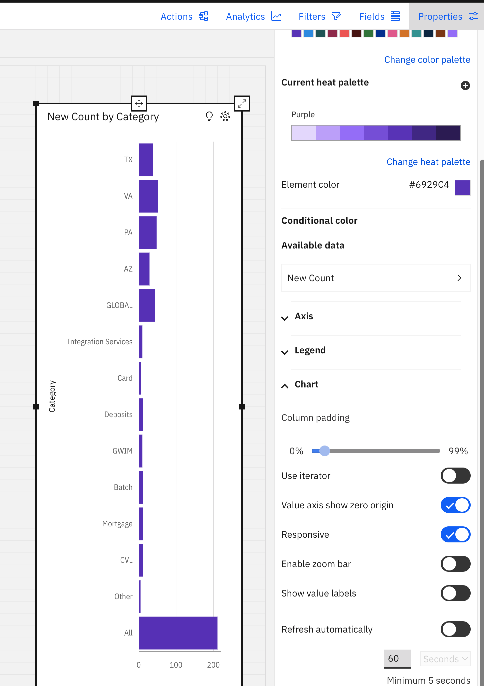

### Customising the schema and mapping
As hinted, you can customise both the schema and mapping to suit your own needs. There are a few steps required to do this which are outlined below, and the order should be followed to prevent any errors.

The steps are based around a working example of adding some new properties to Alerts that you will use in AIOps and subsequently in Cognos dashboards. The properties will be coordinates of the resource that the alert is for: `resource.latitude` and `resource.longitude`.

#### Update the Db2 schema
First we will add three new columns to represent these values, so will need to modify the ALERTS_REPORTER_STATUS table in Db2. We provide a ready-made SQL file to achieve this, that you will need to copy to your Db2 VM:
[alerts_severity_resource_breakdown.sql](../schemas/db2/alerts_severity_resource_breakdown.sql)

On the Db2 VM, connect to your Db2 database (as db2 user):
```
db2 connect to aiopsdb
```
and replace `aiopsdb` with the name of your database.

Next, using the additonal [alerts_severity_resource_breakdown.sql file](../schemas/db2/alerts_severity_resource_breakdown.sql) provided run the following and enure to tweak the path:
```
db2 -td@ -vf <path to the file>\alerts_severity_resource_breakdown.sql
```

This will add some new columns to the main ALERTS_REPORTER_STATUS table, along with a couple of views that can be used for visualisations.
If you have any additional audit processes in place including tables and triggers, you will need to modify those as well. By default, the AIOps schema only provides additional auditing for severity, acknowledgement, owner or team changes.

#### Add the new property definition into AIOps
Follow steps 1-4 in the AIOps documenation here: https://www.ibm.com/docs/en/cloud-paks/cloud-pak-aiops/4.12.0?topic=alerts-configuring-custom-properties-incidents

NOTE - You can simultaneously make the additons of the resource and custom properties. The resulting yaml will look like this:
```
alert:
  resource:
  - name: latitude
    description: Latitude of the location
    type: string
  - name: longitude
    description: Longitude of the location
    type: string
story: {}
```

If you are making subsequent ammendments to the yaml, ensure you follow the steps defined in https://www.ibm.com/docs/en/cloud-paks/cloud-pak-aiops/4.12.0?topic=alerts-configuring-custom-properties-incidents#2-update-or-correct-custom-property-definitions onwards.

#### Update the AIOps policy
Navigate back to your policy in AIOps and edit. In the parameter mapping, you will now need to add the new properties:
```
"LATITUDE": alert.resource.latitude,
"LONGITUDE": alert.resource.longitude
```

Save this. From this point on, you should now see those fields populated in your ALERTS_REPORTER_STATUS table in Db2, assuming the data coming into AIOps will populate these. If not, they will just be null.

If you need to empty the tables in Db2 you can use the following:
```
db2 connect to <your db2 database>
db2 delete from ALERTS_REPORTER_STATUS
```

Repeat the `delete from` command for any of the audit tables or additional tables you have based on ALERTS_REPORTER_STATUS.

#### Refresh the Data module in Cognos
NOTE - The following steps assume you have already configured Cognos to work with your Db2 instance and data. If you have not, refer to [Connecting to your Db2 instance](#connecting-to-your-db2-instance) first and setup the connection and Data module.
Navigate your way to your data module. Under 'Sources' (left hand menu) find your connection (again, defaults to 'DB2INST1'). Click the 3 dot menu and select 'Reload metadata'.

#### Use the changes
You will now be able to use these fields in your dashboards.

### Troubleshooting

- **After being logged out of Cognos, re-selecting the AIOps namespace in the login screen redirects the user back to the login screen.**
  - **Solution:** Navigate back to the home URL (e.g. `https://cogdash1.fyre.ibm.com:9300/bi`) and restart the login chain

- **No data appearing in Db2**
  - **Solution:**
1) Validate the connection is running. If not, check the connection details are correct.
2) Check the logs of the connector. You may see connection related errors in here, or otherwise errors relating to the inserts/updates. If it is the former and you have already validated your connection details, see 3). If it is the latter, see 4).
To get the logs, run the following commands (NOTE the 'db2 integration name' is the name of the integration you defined in AIOps):
```
export DB2_INTEGRATION_NAME=<your db2 integration name>
oc logs $(oc get po | grep -i cp4aiops-db2-integration-$(oc get connectorconfiguration ${DB2_INTEGRATION_NAME} -o=jsonpath='{.metadata.uid}' | awk '{print substr($1, 1, length($1)-3)}') | awk '{print $1}')
```

3) Validate Db2 is running.
4) Validate the mapping, and schema. Errors are typically caused by mismatches in the policy mapping and the Db2 schema. For example, you may be trying to insert a value into a column that is not defined in the schema, or may be using the wrong data type for a column. Refer back to the [customisation guidance](#customising-the-schema-and-mapping).

- **MSR-SMT-2190 error in Cognos when loading metadata**
 - **Solution:**
When loading the metadata, you need to specify that sample data is not loaded. To do this
1) Navigate and click on your data server: **Menu → Manage → Data server connections → Your data server**
2) In Data server connections, find your connection and click the 3 dot menu, then **Assets**.
3) Find your asset/schema (DB2INST1 by default) and click the 3 dot menu, then **Load options**.
4) Deslect **Retrieve sample data** and then click load.


## Dashboarding toolkit
The toolkit is available here: https://github.com/IBM/aiops-ui-extension-toolkit

Review the readme and getting started documentation provided on the repo, along with the additional doc files where appropriate (e.g for a 'Grafana' example review https://github.com/IBM/aiops-ui-extension-toolkit/blob/main/doc/grafana-guide.md).

Additionally, review the AIOps explained videos on Youtube that provide some end-to-end guidance on using the toolkit:
1) https://www.youtube.com/watch?v=0_aQJ0UsNRY&list=PL_4RxtD-BL5uuXsmuneBWS1oCo65Xe1On&index=3
2) https://www.youtube.com/watch?v=SwxqBO8c84U&list=PL_4RxtD-BL5uuXsmuneBWS1oCo65Xe1On&index=4
3) https://www.youtube.com/watch?v=6bZ4WjY0LJI&list=PL_4RxtD-BL5uuXsmuneBWS1oCo65Xe1On&index=5

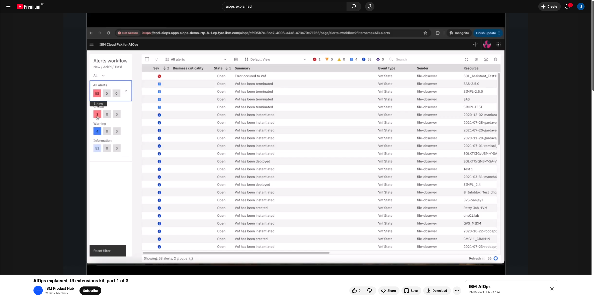

As the name suggests, the toolkit is more a set of tools to facilitate extending the AIOps UI, rather than a dedicated dashboard building tool. Whilst you can build dashboards using the framework and examples provided, you can also use it to embed other pages and provide synergy between custom code and existing AIOps widgets. The use-case recommendations should help guide you to using this vs Cognos, but if there are very particular use-cases that you want to explore then then likelihood is that the toolkit will be the answer, as long as there is no requirement for a GUI based builder.