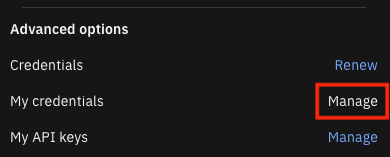

# Standalone Cognos Analytics

Configure OIDC authentication and single sign-on (SSO) between IBM Cloud Pak for AIOps and Cognos Analytics.

## Prereqs
- Install jq where you plan to run this script (if needed).
- Obtain a Cognos API key from an administrator.
  - The Cognos administrator can get the key from any existing namespace under "Profile and Settings - My API keys".
  - The Cognos administrator will first need to "Renew" credentials if "My credentials - Manage" is disabled.
  
  - The Cognos user should have administration capabilities "Manage Namespaces" and "Users, Groups, and Roles".
  
- From the command-line, authenticate with the Cloud Pak for AIOps cluster as an admin user.
- Add the Cloud Pak for AIOps cluster CA to Cognos as documented [here](https://www.ibm.com/docs/en/cognos-analytics/12.0.0?topic=servers-copying-ca-certificate-cognos). If you're using 
the default [OpenShift ingress CA](https://docs.openshift.com/container-platform/4.16/security/certificate_types_descriptions/ingress-certificates.html), find it by running

```bash
kubectl get -n openshift-ingress-operator secrets router-ca -o jsonpath={.data."tls\.crt"} | base64 --decode
```
- Then restart the Cognos server.

## Usage
```bash
./setupCognos.sh -u cognos_url [-k cognos_api_key] [-n cognos_namespace] [-g cognos_gateway] [-c aiops_client] [-r]
```

`-u cognos_url` (required) Cognos server in the form of `http(s)://hostname:port`

`-k cognos_api_key` (optional) API key of the Cognos user under which the setup will run. If no API key is specified, anonymous user will be used.

`-n cognos_namespace` (optional) name of the Cognos namespace that will be created for Cloud Pak for AIOps users. If not specified, the Cloud Pak for AIOps cluster name will be used.

`-g cognos_gateway` (options) path of the Cognos gateway.  If not specified, `/bi` will be used.

`-c aiops_client` (optional) name of the OIDC client that will be created in Cloud Pak for AIOps. If not specified, the Cloud Pak for AIOps cluster name will be used.

`-r` (optional) remove the Cognos namespace and OIDC client.

<a id="notes-section"></a>
## Additional notes
- SSO with OpenShift is currently not supported.

- If the Cloud Pak for AIOps cluster uses self-signed certificates, you need add a browser security exception prior to using these widgets in Cognos. See browser documentation for details.

- Cognos users cannot modify a namespace they are currently using.

- For SSO to be effective, anonymous access must be [disabled](https://ibm.biz/BdKKYW) after successfully running this script.
