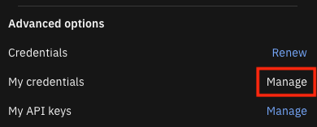

# Widgets

Build and install Cloud Pak for AIOps widgets for Cognos.

## Prereqs
- Node.js v18+
  - Run `npm ci` to install dependencies
- Install jq where you plan to run this script (if needed).
- Obtain a Cognos API key from an administrator.
  - The Cognos administrator can get the key from any existing namespace under "Profile and Settings - My API keys".
  - The Cognos administrator will first need to "Renew" credentials if "My credentials - Manage" is disabled.
  
  - The Cognos user should have Portal Administrator or System Administrator privileges.

## Install widgets
```bash
./installWidgets.sh -u cognos_url [-k cognos_api_key]
```

`-u cognos_url` (required) Cognos server in the form of `http(s)://hostname:port`

`-k cognos_api_key` (optional) API key of the Cognos user installing the widgets. If no API key is specified, anonymous user will be used.
