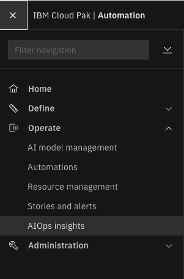

<!-- START doctoc generated TOC please keep comment here to allow auto update -->
<!-- DON'T EDIT THIS SECTION, INSTEAD RE-RUN doctoc TO UPDATE -->
**Table of Contents** 

- [AIOps Insights dashboard](#aiops-insights-dashboard)
  - [Check prerequisites](#check-prerequisites)
  - [Enabling](#enabling)
  - [Disabling](#disabling)
- [Custom data sets](#custom-data-sets)
  - [Create a data set](#create-a-data-set)
  - [Edit an existing data set](#edit-an-existing-data-set)
  - [Delete a data set](#delete-a-data-set)

<!-- END doctoc generated TOC please keep comment here to allow auto update -->

# AIOps Insights dashboard
The AIOps Insights dashboard is currently installed with Cloud Pak for Watson for AIOps, but disabled by default.

Below are the instructions on how to enable the AIOps insights dashboard.

We provide 3 sets of scripts that will perform prerequisite check, enabling, and disabling respectively.

For more information about configuring and using these scripts and the dashboard, see the [IBM Docs for Managing AIOps]( https://ibmdocs-test.mybluemix.net/docs/en/cloud-paks/cloud-pak-watson-aiops/3.4.0?topic=operating-managing-aiops-insights).

## Check prerequisites

```
sh check-prereqs.sh
```

Before you begin you will need the `oc` command available. You can follow the references [here](https://docs.openshift.com/container-platform/4.10/cli_reference/openshift_cli/getting-started-cli.html) to obtain and learn more about this command line tool.
> NOTE: technically this process could be completed via the openshift console, but we attempt to simplify the process with the cli tool

You will need to make sure the following conditions are met:
1. Log in as a cluster admin:
    ```
    oc login
    ```
    > NOTE: the script will not do this for you!
2. Watson AIOps installation is successful
    > The script will check for the component readiness of the active
    > deployments that will directly interact with our scripts

## Enabling
```
sh enable-insights.sh
```

The enablement procedure that this script follows requires the creation of
2 resources: an instance of `insightsui` to deploy the ui workloads and a
deployment of `datarouter` to start populating back end data for the
component.


1. Find the Elasticsearch binding secret - this is required for
   creating the `insightsui`:
    ```
    kubectl get secrets -n {aiops namespace} | grep elastic
    ```

2. Create a yaml definition for an AIOps Insights instance, including the
  Elasticsearch secret name from above.
    ```
    apiVersion: consoleui.aiops.ibm.com/v1
    kind: InsightsUI
    metadata:
      name: insightsui-instance
    spec:
      license:
        accept: true
      size: small
      version: 1.0.0
      elasticSearch:
        bindingSecret: ibm-cp-watson-aiops-elastic-secret
    ```

3. Apply the custom resource yaml.
    ```
    kubectl apply -f {yaml filename} -n {aiops namespace}
    ```

4. Wait for the pod to become ready.
    ```
    kubectl get pods -l app.kubernetes.io/name=aiops-aiops-insights-ui -n {aiops namespace}
    NAME                                 READY   STATUS              RESTARTS   AGE
    aiops-insights-ui-65879c667c-mc25t   0/1     ContainerCreating   0          19s
    ```

5. Log in to the Watson for AIOps console, and verify that there is an AIOps insights item in the left menu. Click this item to display the dashboard.

    


Now you are ready to deploy the datarouter.

1. Find the Elasticsearch binding secret and the kafka binding secret:
    ```
    oc get secrets -n {aiops namespace} | grep elastic-secret
    oc get secrets -n {aiops namespace} | grep kafka-secret
    ```

2. Create the datarouter deployment:
    ```
    cat <<EOF | oc apply -f -
    apiVersion: apps/v1
    kind: Deployment
    metadata:
      name: aiops-insights-ui-datarouting
      namespace: ${NS}
    spec:
      progressDeadlineSeconds: 600
      replicas: 1
      revisionHistoryLimit: 10
      selector:
        matchLabels:
          app.kubernetes.io/component: common-datarouting
          app.kubernetes.io/instance: aiops
          component: saas-disable
      strategy:
        rollingUpdate:
          maxSurge: 25%
          maxUnavailable: 25%
        type: RollingUpdate
      template:
        metadata:
          labels:
            app.kubernetes.io/component: common-datarouting
            app.kubernetes.io/instance: aiops
            component: saas-disable
        spec:
          affinity:
            nodeAffinity:
              requiredDuringSchedulingIgnoredDuringExecution:
                nodeSelectorTerms:
                - matchExpressions:
                  - key: kubernetes.io/arch
                    operator: In
                    values:
                    - amd64
            podAntiAffinity:
              preferredDuringSchedulingIgnoredDuringExecution:
              - podAffinityTerm:
                  labelSelector:
                    matchLabels:
                      app.kubernetes.io/component: common-datarouting
                      app.kubernetes.io/instance: aiops
                  topologyKey: kubernetes.io/hostname
                weight: 50
          containers:
          - env:
            - name: ELASTICSEARCH_BINDING
              value: /home/node/binding/elasticsearch
            - name: KAFKA_BROKERS
              valueFrom:
                secretKeyRef:
                  key: bootstrapServers
                  name: ${KF_BINDING_SECRET}
            - name: KAFKA_SASL_USERNAME
              valueFrom:
                secretKeyRef:
                  key: username
                  name: ${KF_BINDING_SECRET}
            - name: KAFKA_SASL_PASSWORD
              valueFrom:
                secretKeyRef:
                  key: password
                  name: ${KF_BINDING_SECRET}
            - name: KAFKA_SSL_CA
              valueFrom:
                secretKeyRef:
                  key: caCertificate
                  name: ${KF_BINDING_SECRET}
            - name: PIPELINES
              value: es-story-archive
            - name: LOGLEVEL
              value: info
            - name: LOGSTASH_SHARDS
              value: "1"
            - name: LOGSTASH_REPLICAS
              value: "0"
            - name: KAFKA_TOPICPREFIX
              value: cp4waiops-cartridge.
            - name: KAFKA_SSL_ENABLED
              value: "true"
            - name: KAFKA_SASL_MECHANISM
              valueFrom:
                secretKeyRef:
                  key: authMechanism
                  name: ${KF_BINDING_SECRET}
            image: ${DATAROUTER_IMAGE}
            imagePullPolicy: Always
            livenessProbe:
              failureThreshold: 3
              httpGet:
                path: /
                port: 8080
                scheme: HTTP
              initialDelaySeconds: 60
              periodSeconds: 60
              successThreshold: 1
              timeoutSeconds: 20
            name: logstash
            ports:
            - containerPort: 8080
              protocol: TCP
            readinessProbe:
              failureThreshold: 1
              httpGet:
                path: /
                port: 8080
                scheme: HTTP
              initialDelaySeconds: 10
              periodSeconds: 20
              successThreshold: 1
              timeoutSeconds: 20
            resources:
              limits:
                cpu: "1"
                ephemeral-storage: 200Mi
                memory: 2800Mi
              requests:
                cpu: 200m
                ephemeral-storage: 50Mi
                memory: 1400Mi
            securityContext:
              allowPrivilegeEscalation: false
              capabilities:
                drop:
                - ALL
              privileged: false
              readOnlyRootFilesystem: true
              runAsNonRoot: true
            terminationMessagePath: /dev/termination-log
            terminationMessagePolicy: File
            volumeMounts:
            - mountPath: /home/node/binding/elasticsearch
              name: elasticsearch-binding
              readOnly: true
            - mountPath: /home/node/tls/kafka
              name: kafka-ca
              readOnly: true
          dnsPolicy: ClusterFirst
          restartPolicy: Always
          schedulerName: default-scheduler
          securityContext:
            runAsNonRoot: true
          serviceAccount: aiops-insights-ui
          serviceAccountName: aiops-insights-ui
          terminationGracePeriodSeconds: 30
          volumes:
          - name: elasticsearch-binding
            secret:
              defaultMode: 292
              secretName: ${ES_BINDING_SECRET}
          - name: kafka-ca
            secret:
              defaultMode: 292
              items:
              - key: caCertificate
                path: ca.crt
              secretName: ${KF_BINDING_SECRET}
    EOF
    ```
    > NOTE replace all instances of `${ES_BINDING_SECRET}` with the elastic
    > search binding secret name found in step 1

    > NOTE replace all instances of `${KF_BINDING_SECRET}` with the kafka
    > binding secret name found in step 1

    > NOTE replace `${NS}` with the namespace where Watson AIOps is installed.

  3. Wait for the deployment to come ready:
      ```
      > kubectl get deploy aiops-insights-ui-datarouting
      NAME                            READY   UP-TO-DATE   AVAILABLE   AGE
      aiops-insights-ui-datarouting   1/1     1            1           70m
      ```

## Disabling
```
sh uninstall-insights.sh
```

To disable the AIOps dashboard feature, 
```
kubectl delete InsightsUI insightsui-instance -n {aiops namespace}
```
NOTE: Before uninstalling the Watson for AIOps product, you must delete the AIOps Insights resource, or the namespace cannot be deleted.

All of the above can be performed from the RedHat OpenShift console in a similar fashion. 

> NOTE: if you installed via the script then deleting the cr instance
> will also remove the datarouter deployment... if you manually installed
> make sure you also delete the `aiops-insights-ui-datarouting` deployment.

# Custom data sets

Custom data sets can be mounted using config maps. Each config map is treated as a separate data set, i.e. separate demo scenario.

## Create a data set
1. Create a config map from JSON files for a specific demo scenario. You can use the [default data sets](https://github.com/cp4aiops-samples/tree/main/aiops-insights-files/3.4/demo/default/insights) provided with the AIOps Insights dashboard as a template.

    Note: Filename format includes a metric name and optionally time interval (-1, -7 or -30 days), e.g.
    ```
    mttx-1.json
    ```

    If no time interval is provided, the same data set is used for all time intervals.

    Metric names must be one of ```mttx```, ```noisereduction```, ```storyresolution```, or ```metricheader```.

    Place the updated JSON files in a new folder, and run the following command as an admin user, replacing the values in curly brackets.
    ```
    kubectl create configmap demo3 --from-file={path containing json files} -n {aiops namespace}
    ```
    > NOTE: the `{path containing json files}` should be the relative/absolute path
    > to a directory that contains your json files (and not individual json files).
    > You can do a quick validation by looking at your created configmap
    > (`kubectl describe cm demo3`) and making sure that it contains multiple
    > data values.

2. Add the config map name to the list of data sets in an InsightsUI CR spec and save, e.g. 
    ```
    kubectl edit InsightsUI insightsui-instance -n {aiops namespace}
    ...
    spec:
      container:
        resources: {}
      demodatasets:
      - demo1
      - demo2
      - demo3
    ```

3. Wait for the AIOps Insights pod to restart,
    ```
    kubectl get pods -l app.kubernetes.io/name=aiops-aiops-insights-ui -n {aiops namespace}
    NAME                                 READY   STATUS              RESTARTS   AGE
    aiops-insights-ui-65879c667c-mc25t   0/1     ContainerCreating   0          16s
    aiops-insights-ui-8cff7d744-j6pv6    1/1     Running             0          21m

    ```

4. Check the AIOps Insights dashboard to confirm the new data set is present.


## Edit an existing data set

1. If you need to tweak data in an existing data set, edit its config map directly.
    ```
    kubectl edit configmap demo3 -n {aiops namespace}
    ```
    If you need make large changes, it would be best to update the original JSON data files and recreate the config map.

2. Manually restart the AIOps Insights pod, and wait for it to become ready.
    ```
    kubectl delete pods -l app.kubernetes.io/name=aiops-aiops-insights-ui -n {aiops namespace}
    ```

3. View the updated metrics in AIOps Insights dashboard. Reload the browser page to see your changes.

## Delete a data set

1. Remove the config map name from InsightsUI demodatasets property.
    ```
    kubectl edit InsightsUI insightsui-instance -n {aiops namespace}
    ...
    spec:
      container:
        resources: {}
      demodatasets:
      - demo1
      - demo2
    ```

2. Delete the config map
    ```
    kubectl delete configmap demo3 -n {aiops namespace}
    ```

3. Wait for the AIOps Insights pod to become ready.

4. Reload the AIOps Insights dashboard page in your browser. 

All of the above steps can be performed from the RedHat OpenShift console in a similar fashion. 